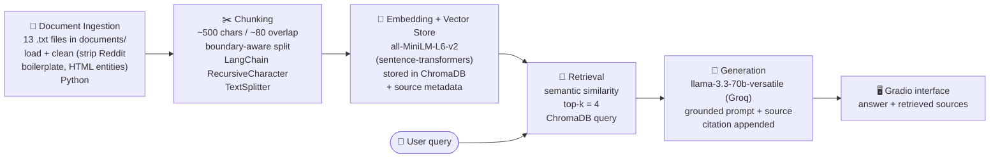

# Project 1 Planning: The Unofficial Guide

> Write this document before you write any pipeline code.
> Your spec and architecture diagram are what you'll use to direct AI tools (Claude, Copilot, etc.) to generate your implementation — the more specific they are, the more useful the generated code will be.
> Update the Retrieval Approach and Chunking Strategy sections if you change your approach during implementation.
> Update this file before starting any stretch features.

---

## Domain

<!-- What domain did you choose? Why is this knowledge valuable and hard to find through official channels? -->
The Unofficial Guide to ASU Tempe Parking & Transit. This system makes searchable the parking and commuting knowledge ASU students actually share with each other — which structures fill by 8am, whether the $720 gold permit is worth it, free park-and-ride and visitor-pass workarounds, light rail reliability, and how to win a citation appeal. This knowledge is scattered across r/ASU threads, Google reviews of individual garages, and word-of-mouth; the official ASU parking site lists rates and rules but never tells you that the Rural Rd roof is open at 10am or that you can park free at the Tempe Library and ride the Orbit in.
---

## Documents

<!-- List your specific sources: URLs, subreddit names, forum threads, or file descriptions.
     Aim for at least 10 sources that together cover different subtopics or perspectives within your domain. -->

My corpus is **13 documents** spanning two source types (Reddit threads and Google reviews of specific garages) so retrieval sees more than one writing style. Documents marked **REAL** were collected from live r/ASU threads; the rest are realistic stand-ins I'll progressively replace with real threads before the final evaluation. Each file carries a `Source:` / `Topic:` header so source attribution survives into the metadata.

| # | Source | Description | Subtopic bucket | Location |
|---|--------|-------------|-----------------|----------|
| 1 | r/ASU (REAL) | Free/cheap parking hacks: park-and-ride, free lots, visitor & appointment passes | Free parking | `documents/reddit_free_parking_hacks_REAL.txt` |
| 2 | r/ASU (REAL) | Getting around without a car: light rail, Orbit, buses, bikes, theft | Transit / bikes | `documents/reddit_getting_around_transit_bikes_REAL.txt` |
| 3 | r/ASU | Gold vs. maroon permit cost, types, waitlists, plate-based enforcement | Permits | `documents/reddit_permits_cost_waitlist.txt` |
| 4 | r/ASU | Which structure fills earliest + late-morning workarounds | Structures | `documents/reddit_which_structure_fills_first.txt` |
| 5 | r/ASU | U-Pass vs. driving from Mesa; light rail reliability & safety | Light rail | `documents/reddit_lightrail_upass_commute.txt` |
| 6 | r/ASU | Intercampus shuttles (Tempe/Downtown/Poly/West) | Shuttles | `documents/reddit_intercampus_shuttle.txt` |
| 7 | r/ASU | Bikes vs. scooters vs. walking; theft & dismount zones | Bikes / scooters | `documents/reddit_bikes_scooters_theft.txt` |
| 8 | r/ASU | Citation appeals, booting, registration holds | Citations / appeals | `documents/reddit_citations_appeals.txt` |
| 9 | r/ASU | Game-day / football parking lot conversions | Events | `documents/reddit_gameday_football_parking.txt` |
| 10 | r/Tempe | Contrarian defense of the light rail (disagrees with #5 in places) | Light rail | `documents/reddit_lightrail_defense_contrarian.txt` |
| 11 | Google Reviews | Tyler St Garage reviews (fills first, central) | Structures | `documents/google_reviews_tyler_st_garage.txt` |
| 12 | Google Reviews | Rural Road Garage reviews (roof open late) | Structures | `documents/google_reviews_rural_road_garage.txt` |
| 13 | Google Reviews | Apache Blvd Structure reviews (fills last) | Structures | `documents/google_reviews_apache_structure.txt` |

---

## Chunking Strategy

<!-- How will you split documents into chunks?
     State your chunk size (in tokens or characters), overlap size, and explain why those
     numbers fit the structure of your documents.
     A review-heavy corpus warrants different chunking than a long FAQ. -->

**Chunk size:** ~500 characters (~100–125 tokens) target, split on natural boundaries (blank lines / individual comments / individual reviews) rather than a hard character cut.

**Overlap:** ~80 characters (~16%).

**Reasoning:** My documents are not long-form guides — they are collections of short, self-contained units: a single Reddit comment or a single Google review is usually 1–4 sentences (~150–500 chars). The ideal chunk is therefore **one complete opinion**: "Tyler St fills first, be there by 8:15" or "appeal plate-reader errors with a screenshot of your permit." So I split on comment/review boundaries first and only fall back to a ~500-char cut when a single comment runs long.

- **Why not smaller (e.g. 200 chars):** a 200-char chunk would slice "Rural Rd fills by 9:30, but the roof level is open even at 10am" in half. The retrievable half ("Rural Rd fills by 9:30") would actively *mislead* a query about finding a late spot. Short opinion text loses its point when fragmented.
- **Why not larger (e.g. 1500 chars):** a whole document mixes unrelated buckets (permits + bike theft + parking) into one embedding, so a specific query matches a diluted average and pulls in irrelevant context. It would also blow past **all-MiniLM-L6-v2's 256-token input cap**, silently truncating anything I embed beyond that — a real correctness bug, not just a quality one.
- **What overlap buys:** facts that straddle a boundary (a workaround stated one comment after the problem) stay recoverable from at least one chunk. 16% is enough to bridge a sentence without duplicating whole opinions.
- **Sanity check on count:** ~25.6k total chars / ~420-char effective stride ≈ **~60 chunks** across 13 docs — comfortably above the rubric's "fewer than 50 = too large" floor and far below the 2,000 "too small" ceiling.
- **How I'd know it's wrong:** too small → top results are sentence fragments with no standalone answer; too large → every query returns the same few mega-chunks with high distance scores because nothing is specific.

---

## Retrieval Approach

<!-- Which embedding model are you using (e.g., all-MiniLM-L6-v2 via sentence-transformers)?
     How many chunks will you retrieve per query (top-k)?
     If you were deploying this for real users and cost wasn't a constraint, what tradeoffs
     would you weigh in choosing a different embedding model — context length, multilingual
     support, accuracy on domain-specific text, latency? -->

**Embedding model:** `all-MiniLM-L6-v2` via `sentence-transformers`. Runs locally, no API key or rate limit, 384-dim embeddings, fast enough to embed ~60 chunks in seconds on CPU. Its 256-token input cap is fine because my chunks are ~125 tokens.

**Top-k:** Start at **k = 4**. My buckets are fairly distinct, so 4 chunks usually covers one topic plus its caveats without dragging in unrelated buckets. I'll tune empirically in Milestone 4 — if synthesis questions (like "is the light rail worth it?") miss the contrarian view, I'll raise to 5–6; if answers get diluted with off-topic chunks, I'll drop to 3.
- *Too few:* the chunk holding the answer may simply not be in the set — the LLM then can't answer even though the corpus contains it.
- *Too many:* loosely related chunks dilute the context and pull the generated answer off-target, and a grounded model may hedge because the context is noisy.
- *Why semantic search works here:* embeddings capture meaning, so a query like "cheapest way to get to campus" matches a chunk about the "$200/semester unlimited U-Pass" even with zero shared keywords — exactly the vocabulary gap that keyword search would miss in opinion text.

**Production tradeoff reflection:** If cost weren't a constraint and this served real students, I'd weigh:
- **Accuracy on domain-specific text:** a larger model (e.g. OpenAI `text-embedding-3-large` or `bge-large`) better distinguishes near-identical complaints ("Tyler fills at 8:15" vs "Rural fills at 9:30") that MiniLM may collapse — the single biggest quality lever for this corpus.
- **Context length:** a longer input window would let me embed full long guides without truncation, relaxing my chunking constraints.
- **Multilingual support:** ASU has a large international population; a multilingual model (e.g. `multilingual-e5`) would let students query in their first language.
- **Latency & local vs. API:** local MiniLM has zero per-query cost and no network dependency — attractive for a free student tool — whereas an API model adds latency, cost, and a privacy consideration (sending student queries off-device). For production I'd likely keep embeddings local for cost/privacy but A/B test a hosted large model on my eval set before committing.

---

## Evaluation Plan

<!-- List your 5 test questions with their expected correct answers.
     Questions should be specific enough that you can judge whether the system's response
     is right or wrong. "What are good dining halls?" is too vague.
     "What do students say about wait times at [dining hall name] during lunch?" is testable. -->

Each question targets a different bucket and has a verifiable answer traceable to a specific document. **Q5 is deliberately hard** — designed to surface a failure (see reasoning below the table).

| # | Question | Expected answer | Grounding doc(s) |
|---|----------|-----------------|------------------|
| 1 | Which ASU parking structure fills up the earliest, and what's a workaround for finding a spot late in the morning? | **Tyler St** fills earliest (full lower levels by ~8:15am). Workarounds: the **roof/top level of Rural Rd** is often open even at 10am, and **Apache Blvd** stays open latest (~10:30–11am). | #4, #11, #12, #13 |
| 2 | What are some free or very cheap ways to park near ASU Tempe without buying a permit? | Park-and-ride lots (Park Place, Price & Apache, McClintock & Apache) + light rail; free lot at **Tempe Beach Park** + streetcar on Mill; free at **Tempe Public Library** + free **Orbit** bus; the **LDS institute $5 pass**; Lemon/Orange St apartments (~$5/day or free guest parking); sign in at the **Speech & Hearing building / health clinic** if you have an appointment. | #1 |
| 3 | If I get a parking ticket because the plate reader misread my plate, can I appeal it and how? | Yes — appeal online through the parking portal and attach a **screenshot of your active permit + payment confirmation**; plate-reader misreads are commonly dismissed. Appeal within the **~10–14 day window**. "I was only there 5 minutes" type excuses are auto-denied. | #8 |
| 4 | Is the U-Pass worth it for commuting from Mesa, and how reliable is the light rail? | Yes — the **U-Pass (~$200/semester, unlimited rail + bus)** is far cheaper than a $720 gold permit; Mesa → Tempe is ~30–35 min; trains run every ~12 min in the daytime and are generally reliable and safe during the day, but sketchier late at night (esp. the downtown Phoenix stretch). Only one line, so you must live near a station. | #5, #2, #10 |
| 5 | *(hard / synthesis)* Overall, should I rely on the light rail instead of driving to ASU? | A **balanced** answer: pro — cheap (U-Pass), no parking hassle, free park-and-rides, can read on board; con — only one line, ~35 min each way (slower than a 12-min drive), sketchier late at night, and useless for Polytechnic or for schedules with long campus gaps. A correct answer must surface **both sides**, since the corpus genuinely disagrees. | #5, #10, #2, #6 |

**Why Q5 is the planned failure case:** the answer isn't in any single chunk — it requires synthesizing a pro-transit doc (#10), a cost doc (#5), and the caveats (night safety, Poly, time cost) scattered across #5/#6. With k=4, retrieval may pull only the enthusiastic chunks and miss the caveats, yielding a one-sided ("partially accurate") answer. This tests whether retrieval surfaces *disagreement*, not just relevance — and it's exactly the kind of failure the rubric wants documented honestly.

---

## Anticipated Challenges

<!-- What could go wrong? Name at least two specific risks with reasoning.
     Consider: noisy or inconsistent documents, missing source attribution, off-topic
     retrieval, chunks that split key information across boundaries. -->

1. **Conflicting / repetitive opinions across documents.** Many docs repeat the same complaint ("permits expensive, structures full by 9am"), so embeddings can look near-identical and retrieval may return four chunks that all say the same thing while missing a contrarian or more specific one. Worse, docs sometimes *disagree* (the contrarian light-rail doc vs. the night-safety warnings) — if retrieval grabs only one side, the answer is confidently one-sided. *Mitigation:* deliberate source variety, plus tuning top-k and inspecting retrieved chunks for diversity, not just relevance.

2. **Key fact split across a chunk boundary.** A problem and its workaround are often stated in adjacent sentences ("Rural fills by 9:30 — but the roof is open at 10"). If the boundary lands between them, the retrievable chunk is misleading on its own. *Mitigation:* boundary-aware splitting + 16% overlap, and reading sample chunks in Milestone 3 before embedding.

3. **Grounding failures / hallucination.** The LLM knows generic facts about ASU parking from training data and may answer plausibly even when the retrieved chunks don't support it. *Mitigation:* a strict system prompt ("answer only from the provided context; if it's not there, say you don't have enough information") and a no-answer test question to verify it declines rather than invents.

4. **Source attribution drift.** If the source filename isn't attached to each chunk's metadata at embedding time, citations can't be reconstructed at generation. *Mitigation:* attach `source` metadata in the ingestion step and append it programmatically, not leave it to the LLM.

---

## Architecture

<!-- Draw a diagram of your pipeline showing the five stages:
     Document Ingestion → Chunking → Embedding + Vector Store → Retrieval → Generation
     Label each stage with the tool or library you're using.
     You can use ASCII art, a Mermaid diagram, or embed a sketch as an image.
     You'll use this diagram as context when prompting AI tools to implement each stage. -->

Pipeline in one line: **Ingest (Python) → Chunk (LangChain splitter) → Embed (MiniLM) + Store (ChromaDB) → Retrieve top-4 → Generate grounded answer (Groq Llama-3.3) → Gradio UI.**

---

## AI Tool Plan

<!-- For each part of the pipeline below, describe:
     - Which AI tool you plan to use (Claude, Copilot, ChatGPT, etc.)
     - What you'll give it as input (which sections of this planning.md, which requirements)
     - What you expect it to produce
     - How you'll verify the output matches your spec

     "I'll use AI to help me code" is not a plan.
     "I'll give Claude my Chunking Strategy section and ask it to implement chunk_text()
     with my specified chunk size and overlap" is a plan. -->

**Milestone 3 — Ingestion and chunking (Claude):** I'll give Claude my **Documents** table (file naming + the `Source:`/`Topic:` header format) and my **Chunking Strategy** section, and ask it to implement `load_documents()` (read every `.txt` in `documents/`, parse the header into metadata, return text + source) and `chunk_text(text, size=500, overlap=80)` using a boundary-aware `RecursiveCharacterTextSplitter`. I expect a script that emits a list of `{text, source}` chunks. **Verify:** print 5 random chunks and confirm each is a self-contained opinion with no leftover boilerplate, and that total chunk count lands ~60.

**Milestone 4 — Embedding and retrieval (Claude):** I'll give Claude my **Retrieval Approach** section and the architecture diagram, and ask it to implement `embed_and_store(chunks)` — embed with `all-MiniLM-L6-v2`, write to a persistent ChromaDB collection with `source` + chunk-position metadata — and `retrieve(query, k=4)` returning chunks + distances + sources. **Verify:** run 3 eval questions, print distance scores, confirm top results are on-topic and < ~0.5; if any ChromaDB API call is unfamiliar I'll ask Claude to explain it before trusting it.

**Milestone 5 — Generation and interface (Claude):** I'll give Claude my grounding requirement (answer from retrieved context only; decline if absent), the desired output shape (`{answer, sources}`), and the Gradio skeleton, and ask it to wire `ask(query)` end-to-end against Groq `llama-3.3-70b-versatile`. **Verify:** read the generated system prompt to confirm grounding is *enforced* (not suggested) and that sources are appended programmatically, then run the no-answer test question to confirm it declines instead of hallucinating.

> **AI-usage guardrail note:** I wrote the decisions in this spec myself (chunk size, top-k, eval questions, failure hypothesis); I'm using AI to *implement* them, not to choose them, so I can debug what comes back.
